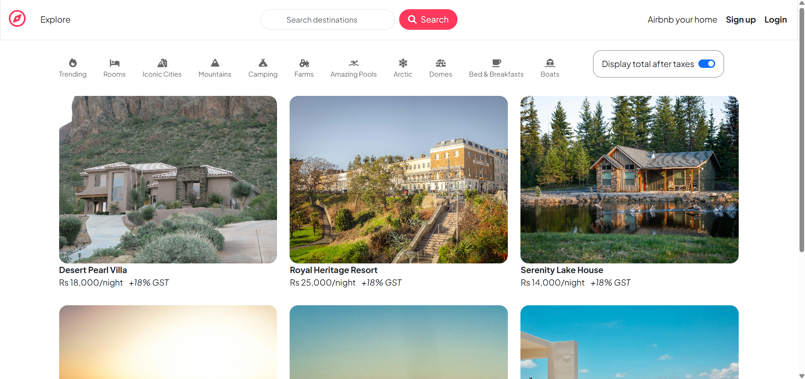
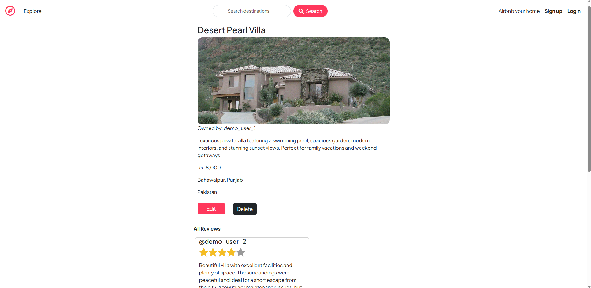
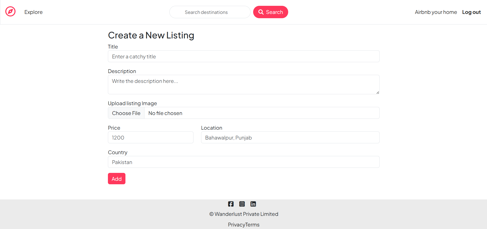
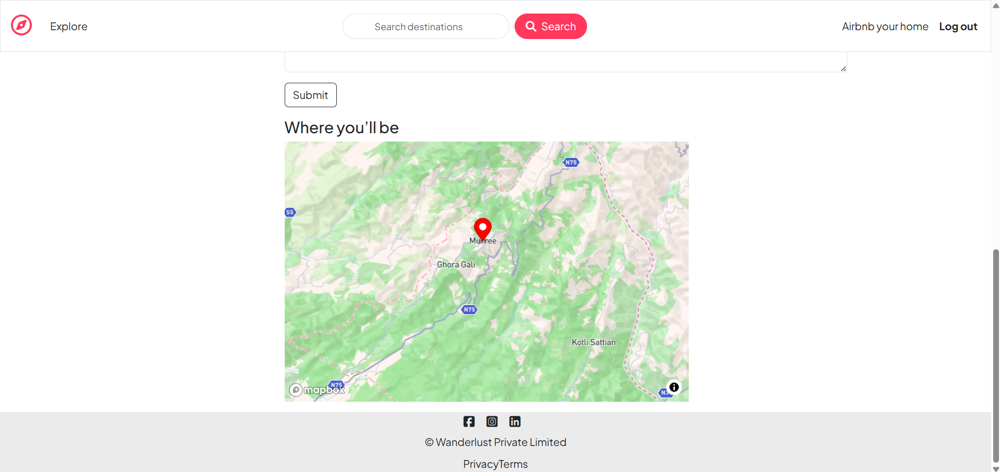
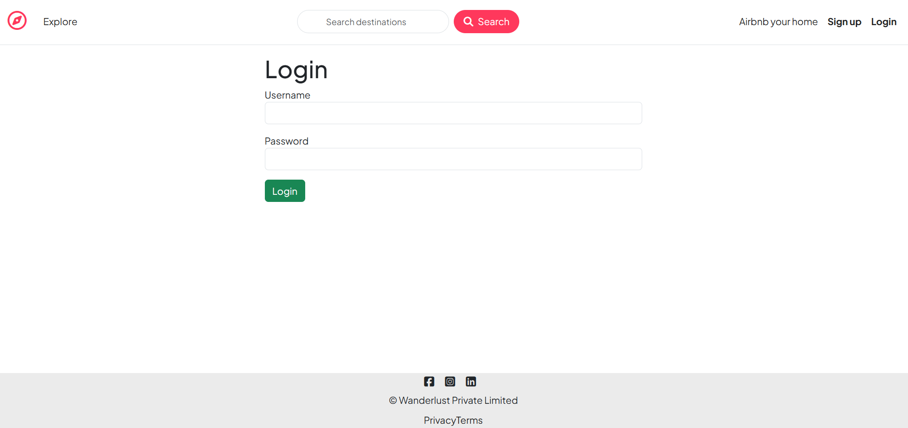

# WanderLust – Online Rental Marketplace (Geospatial Property Platform)


A full-stack geospatial rental marketplace inspired by modern property rental platforms. WanderLust enables users to discover, create, manage, and review rental properties through interactive maps, cloud-hosted media, and secure authentication workflows.

---

## 🚀 Live Demo

**Application:** https://online-rental-marketplace-geospatial.onrender.com/listings

---

## 📸 Application Screenshots

### Homepage



---

### Property Details Page



---

### Create Listing Page



---

### Interactive Map View



---

### Authentication System



---

## 📊 Project Metrics

* Full-stack web application
* MVC Architecture
* RESTful Routing Implementation
* User Authentication & Authorization
* Cloudinary Media Management
* Mapbox Geospatial Integration
* MongoDB Atlas Database
* Session-Based Authentication
* Production Deployment on Render
* Responsive User Interface

---

## 🎯 Project Overview

WanderLust is a production-oriented rental marketplace that replicates core features commonly found in modern accommodation platforms.

Users can:

* Browse available rental properties
* View listings on an interactive map
* Register and authenticate securely
* Create new property listings
* Upload property images
* Edit and manage owned listings
* Leave ratings and reviews
* Manage user-generated content

The project demonstrates full-stack application development, cloud integrations, database relationships, authentication systems, and deployment practices.

---

## ✨ Key Features

### Property Management

* Create property listings
* Update listing information
* Delete listings
* Upload listing images
* Cloud-based image storage

### Authentication & Authorization

* User registration
* User login
* Session management
* Route protection
* Ownership verification

### Reviews & Ratings

* Create reviews
* Delete reviews
* Dynamic rating system
* User-generated feedback

### Geospatial Functionality

* Interactive Mapbox maps
* Property location visualization
* Geocoding integration
* Coordinate-based property display

### User Experience

* Responsive layout
* Flash notifications
* Form validation
* Error handling
* Clean Bootstrap UI

---

## 🛠️ Tech Stack

### Frontend

* HTML5
* CSS3
* Bootstrap 5
* EJS
* JavaScript

### Backend

* Node.js
* Express.js

### Database

* MongoDB Atlas
* Mongoose

### Authentication

* Passport.js
* Passport Local
* Express Session
* Connect Mongo

### Cloud Services

* Cloudinary
* Mapbox Geocoding API
* MongoDB Atlas
* Render

---

## 🔥 Technical Highlights

### MVC Architecture

Implemented a clean Model-View-Controller architecture to improve maintainability, scalability, and separation of concerns.

### RESTful API Design

Developed resource-oriented routes following REST principles for listings, reviews, and users.

### Secure Authentication

Implemented Passport.js authentication with session-based authorization and ownership checks.

### Cloud-Based Media Storage

Integrated Cloudinary for efficient image upload, storage, optimization, and delivery.

### Geospatial Mapping

Leveraged Mapbox Geocoding API to convert locations into coordinates and display listings on interactive maps.

### Database Relationships

Designed relational data models using Mongoose references and population between:

* Users
* Listings
* Reviews
---

## 🔌 API Endpoints

| Method | Endpoint                        | Description          |
| ------ | ------------------------------- | -------------------- |
| GET    | /listings                       | Fetch all listings   |
| GET    | /listings/:id                   | Fetch single listing |
| POST   | /listings                       | Create listing       |
| PUT    | /listings/:id                   | Update listing       |
| DELETE | /listings/:id                   | Delete listing       |
| POST   | /listings/:id/reviews           | Create review        |
| DELETE | /listings/:id/reviews/:reviewId | Delete review        |

---

## ⚙️ Installation

### Clone Repository

```bash
git clone https://github.com/muhammadjunaidfarooq/wanderlust-geospatial-rental-platform.git

cd wanderlust-geospatial-rental-platform
```

### Install Dependencies

```bash
npm install
```

### Configure Environment Variables

Create a `.env` file:

```env
ATLASDB_URL=your_mongodb_connection_string

SECRET=your_session_secret

CLOUD_NAME=your_cloudinary_cloud_name
CLOUD_API_KEY=your_cloudinary_api_key
CLOUD_API_SECRET=your_cloudinary_api_secret

MAP_TOKEN=your_mapbox_token
```

### Start Application

```bash
npm start
```

or

```bash
node app.js
```

Application runs at:

```text
http://localhost:8080
```

---

## 🚀 Future Enhancements

* Booking System
* Availability Calendar
* Payment Integration
* User Profiles
* Wishlist Feature
* Property Search Filters
* Messaging System
* Admin Dashboard
* Property Analytics

---

## 📚 What I Learned

Through this project I strengthened my understanding of:

* Full-Stack Web Development
* MVC Architecture
* RESTful API Design
* Authentication & Authorization
* Cloud Integrations
* Geospatial Applications
* MongoDB Data Modeling
* Production Deployment
* Debugging & Troubleshooting

---

## 👨‍💻 Author

### Muhammad Junaid Farooq

Software Engineer | MERN Stack Developer

**Portfolio:** https://muhammadjunaid-swe.vercel.app/

**LinkedIn:** https://www.linkedin.com/in/muhammadjunaidfarooq/

**GitHub:** https://github.com/muhammadjunaidfarooq

---

## 📄 License

This project is intended for educational, learning, and portfolio purposes.
